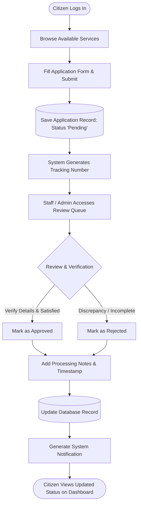
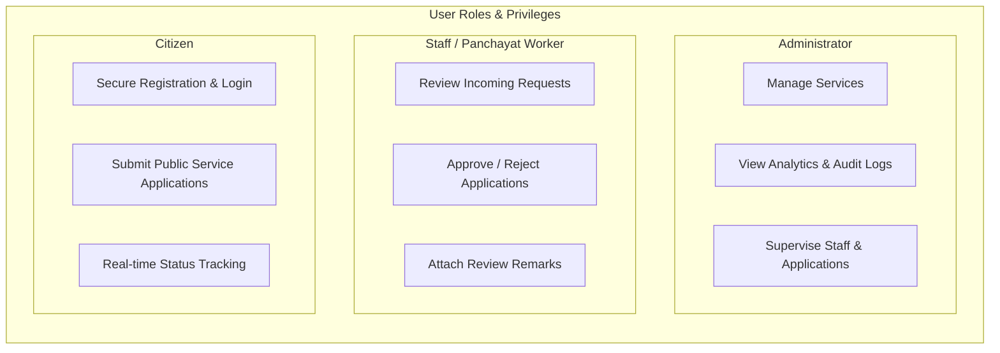

# Digital Gram Panchayat

[](https://www.python.org/)
[](https://palletsprojects.com/p/flask/)
[](https://www.sqlite.org/)
[](https://getbootstrap.com/)
[](#23-license)
[](https://github.com/viraj24bce10396/Digital-Gram-Panchayat-Python/pulls)

A smart and practical e-governance solution designed to digitize local public service delivery and improve the efficiency of village-level administration. The project enables citizens to apply for essential civic services, track their requests, and interact with local government systems through a web-based portal. It also provides role-based access for staff and administrators to review, process, and manage applications in a structured and transparent manner.

This project is developed as a real-world academic solution that demonstrates the use of web technologies for digital governance, citizen service management, and village administration modernization.

---

## Table of Contents

- [1. Project Overview](#1-project-overview)
- [2. Motivation and Importance](#2-motivation-and-importance)
- [3. Problem Statement](#3-problem-statement)
- [4. Objectives](#4-objectives)
- [5. Scope of the Project](#5-scope-of-the-project)
- [6. Target Users](#6-target-users)
- [7. Core Functional Modules](#7-core-functional-modules)
- [8. System Workflow](#8-system-workflow)
- [9. Role-Based Access Design](#9-role-based-access-design)
- [10. Business Logic and Validation](#10-business-logic-and-validation)
- [11. Technical Architecture](#11-technical-architecture)
- [Installation & Setup Guide](#installation--setup-guide)
- [Default Login Credentials](#default-login-credentials)
- [12. Project Structure & Modules](#12-project-structure--modules)
  - [12.1 Directory Structure](#121-directory-structure)
  - [12.2 Application Source Files](#122-application-source-files)
  - [12.3 Application Routes & Endpoints](#123-application-routes--endpoints)
  - [12.4 Pre-configured Public Services Catalog](#124-pre-configured-public-services-catalog)
- [13. Data Model and Entities](#13-data-model-and-entities)
- [14. Security Considerations](#14-security-considerations)
- [15. User Experience and Interface Design](#15-user-experience-and-interface-design)
- [16. Social Impact](#16-social-impact)
- [17. Benefits of the Project](#17-benefits-of-the-project)
- [18. Challenges Encountered](#18-challenges-encountered)
- [19. Future Enhancements](#19-future-enhancements)
- [20. Conclusion](#20-conclusion)
- [21. Final Statement](#21-final-statement)
- [22. Acknowledgements](#22-acknowledgements)
- [23. License](#23-license)
- [24. Project Status](#24-project-status)
- [25. Contributing Guidelines](#25-contributing-guidelines)
- [26. Authors & Contributors](#26-authors--contributors)

---

## 1. Project Overview

Digital Gram Panchayat is a web application built to replace inefficient paper-based processes in rural administration. In many village-level systems, citizens still depend on manual forms, unofficial records, and long queues, which leads to delays, confusion, and poor transparency. This project provides a simple but effective digital alternative.

The main objective is to create a structured digital workflow where:

- Citizens can register and log in securely.
- Citizens can view and apply for available services.
- Citizens can track the progress of their applications.
- Staff can validate requests and update application status.
- Admins can manage services and monitor the platform.

The system is designed to handle common local government processes in a clean, role-based digital environment.

---

## 2. Motivation and Importance

Local governance systems play a vital role in the day-to-day life of citizens. However, many of these systems still rely on outdated manual methods. This often causes:

- Delay in issuing certificates and approvals
- Loss or mishandling of records
- Difficult communication between citizens and officials
- Lack of transparency in application processing
- Unorganized workflow tracking and follow-up
- Increased administrative burden on staff

With increasing digital adoption, there is a strong need for technology-driven governance systems that are easy to use, accessible, and secure. Digital Gram Panchayat aims to bridge this gap by bringing village-level public services into a digital workflow.

---

## 3. Problem Statement

Village administration systems often face the challenge of handling citizen requests manually. This leads to various issues such as ineffective record management, delayed service delivery, poor transparency, and inconsistent communication between departments and the public.

The absence of a centralized digital system means:

- Citizens must repeatedly visit the office for status updates.
- Staff must handle paperwork manually and maintain scattered records.
- Application tracking is difficult and often unreliable.
- There is no transparent system for verifying processing history.
- Staff workload increases significantly.

Digital Gram Panchayat solves this by creating a centralized digital workflow for public service processing and monitoring.

---

## 4. Objectives

The key objectives of the project are:

1. Digitize public service requests at the village administration level.
2. Improve access to government services for citizens.
3. Reduce paperwork and processing delays.
4. Create a transparent request-tracking system.
5. Support role-based access for citizen, staff, and admin users.
6. Build a scalable and maintainable e-governance web application.
7. Demonstrate practical software engineering in a social-impact context.

---

## 5. Scope of the Project

The project focuses on creating a digital application workflow for common public service requests. The system supports the following functional areas:

- User registration and authentication
- Service browsing
- Application submission
- Status tracking
- Staff review and decision updates
- Admin dashboard and service management
- Notification and workflow visibility

The current project is designed as a working academic prototype and can be extended with additional modules such as document upload, verification workflows, digital signatures, PDF generation, and notifications.

---

## 6. Target Users

### Citizens
Citizens use the platform to register, submit service requests, monitor application progress, and access updates on public service workflows.

### Staff / Panchayat Workers
Staff members review incoming applications, validate details, and update statuses such as pending, approved, rejected, or completed.

### Administrators
Administrators can manage services, monitor overall platform activity, and supervise requests across the system.

---

## 7. Core Functional Modules

### 7.1 User Authentication Module
This module handles user sign-up and login for different categories of users. It ensures secure access and supports role-based navigation after login.

### 7.2 Service Management Module
This module allows administrators to define and manage the list of public services available to citizens. Each service includes basic metadata such as name, description, processing time, fee, and required documents.

### 7.3 Application Submission Module
Citizens can choose a service and submit the required details. The application is stored in the database and assigned a tracking number.

### 7.4 Review and Approval Module
Staff and admin users review submitted applications and decide whether the application should be approved, rejected, or kept pending. This is the central workflow of the project.

### 7.5 Tracking and Monitoring Module
Citizens can review the status of their requests, and staff/admin can monitor the progress of multiple applications across the system.

### 7.6 Notification Module
The system supports simple notification-based updates to alert users about status changes and successful submissions.

### 7.7 Dashboard Module
Dashboards provide a summary of system activity, total users, total applications, pending tasks, and recent requests for administrative monitoring.

---

## 8. System Workflow

The system follows a streamlined operational workflow for public administration:



1. **User registers and logs into the platform.**
2. **User browses the available public services.**
3. **User submits a service request with required details.**
4. **The system creates and saves the application record** with a unique tracking ID.
5. **Staff/admin reviews the request and attached details.**
6. **The request status is updated** (Approved / Rejected) alongside administrative remarks.
7. **The citizen views updates and notifications** directly from their personal dashboard.

This creates a transparent **Record → Review → Update → Monitor** cycle for public administration.

---

## 9. Role-Based Access Design

A major strength of the project is its strict role-based authorization system:



### Citizen Role
- Registration and secure authentication
- Browse active public service catalog
- Submit service requests with personal details
- Track individual application statuses and read review remarks
- View and update profile information

### Staff Role
- Review all submitted citizen requests
- Update application statuses (`pending`, `approved`, `rejected`)
- Attach administrative notes and processing explanations
- Monitor workflow queues and pending tasks

### Admin Role
- Create, update, and manage public service offerings
- View high-level system statistics and usage counters
- Review audit logs and track platform activity
- Supervise all administrative and staff workflows

This design ensures proper access control, principle of least privilege, and prevents unauthorized actions.

---

## 10. Business Logic and Validation

The project implements common validation and business rules to ensure data quality and workflow consistency. Some examples include:

- Required fields must be filled during registration and application submission.
- Email format validation is checked.
- Phone numbers are verified using pattern constraints.
- Pincode and address data are checked for completeness.
- Service category and status values are maintained within defined forms.
- Only authenticated users can access protected features.

These validation steps make the application more reliable and reduce the risk of incorrect or incomplete submissions.

---

## 11. Technical Architecture

The application follows a standard Flask-based architecture:

- Frontend: HTML, CSS, Bootstrap, JavaScript
- Backend: Python and Flask
- Database: SQLite
- ORM: Flask-SQLAlchemy
- Authentication: Flask-Login
- Form Handling: WTForms

This architecture allows the project to remain modular, maintainable, and suitable for academic demonstration and future extension.

---

## Installation & Setup Guide

Follow these instructions to set up the Digital Gram Panchayat portal locally on your development machine.

### Prerequisites

Ensure you have the following installed:
- **Python**: Version 3.9, 3.10, or 3.11 ([Download Python](https://www.python.org/downloads/))
- **Git**: Version control client ([Download Git](https://git-scm.com/))
- **pip**: Python package manager (included with standard Python installations)

---

### Step-by-Step Quickstart

#### 1. Clone the Repository
```bash
git clone https://github.com/viraj24bce10396/Digital-Gram-Panchayat-Python.git
cd Digital-Gram-Panchayat-Python
```

#### 2. Create and Activate a Virtual Environment
- **On Windows (PowerShell / Command Prompt):**
  ```powershell
  python -m venv venv
  .\venv\Scripts\activate
  ```
- **On macOS / Linux:**
  ```bash
  python3 -m venv venv
  source venv/bin/activate
  ```

#### 3. Install Required Dependencies
Install the pinned libraries listed in `requirements.txt`:
```bash
pip install -r requirements.txt
```

#### 4. Configure Environment Variables
Copy `.env.example` to create your local `.env` configuration file:
- **On Windows (PowerShell):**
  ```powershell
  Copy-Item .env.example .env
  ```
- **On macOS / Linux:**
  ```bash
  cp .env.example .env
  ```

Configurable parameters:
| Key | Default Value | Description |
|---|---|---|
| `FLASK_APP` | `app.py` | Flask application entrypoint |
| `FLASK_DEBUG` | `True` | Hot-reloading and development debugging mode |
| `SECRET_KEY` | `change-this-secret-key` | Secret key for session security and CSRF protection |
| `DATABASE_URL` | `sqlite:///gram_panchayat.db` | SQLite database file location |

#### 5. Run the Application
Start the Flask development server:
```bash
python app.py
```
> **Note:** On first startup, the database tables are automatically initialized, the default administrator account is seeded, and standard public services are populated.

#### 6. Access the Application
Open your web browser and navigate to:
```
http://127.0.0.1:5000
```
or
```
http://localhost:5000
```

---

### Default Login Credentials

For testing and demonstration, use the pre-configured administrator account or register as a citizen:

| Role | Email / Identifier | Password | Access Capabilities |
|---|---|---|---|
| **Administrator** | `admin@panchayat.in` | `Admin@123` | Full system access, service catalog creation, and application management |
| **Citizen** | *Self-register via portal* | *User defined* | Browse public catalog, submit service requests, and track status |
| **Staff Member** | *Configured by admin* | *User defined* | Review pending applications, verify documents, and approve/reject |

---

## 12. Project Structure & Modules

### 12.1 Directory Structure

The project follows a clean, modular Model-View-Template (MVT) architecture:

```text
Digital-Gram-Panchayat-Python/
│
├── static/                      # Static web assets
│   ├── css/
│   │   └── style.css            # Custom responsive styling and theme overrides
│   └── js/
│       └── script.js            # Client-side form interaction scripts
│
├── templates/                   # Jinja2 presentation templates
│   ├── base.html                # Master layout (Bootstrap 5 navigation & footer)
│   ├── home.html                # Public landing page with service highlights
│   ├── login.html               # Secure role-based login portal
│   ├── register.html            # Citizen onboarding registration form
│   ├── dashboard.html           # Citizen dashboard with stats and recent requests
│   ├── services.html            # Catalog of all available civic services
│   ├── service_detail.html      # Individual service application submission form
│   ├── my_applications.html     # Application status tracking list
│   ├── profile.html             # User profile information & details update
│   ├── staff_dashboard.html     # Staff workspace to review citizen submissions
│   ├── review_application.html  # Status update and approval notes form
│   ├── admin_dashboard.html     # System overview metrics and management
│   ├── add_service.html         # Administrator interface to create new services
│   ├── 404.html                 # Custom Not Found error page
│   └── 500.html                 # Custom Internal Server Error page
│
├── docs/                        # Presentation & academic reference documents
│   ├── ppt-outline.md           # Presentation slide deck outline
│   └── whatsapp-summary.md      # Concise project summary & viva notes
│
├── .env.example                 # Environment configuration template
├── .gitattributes               # Linguist language statistics overrides
├── .gitignore                   # Git exclusion rules (venv, *.db, pycache)
├── app.py                       # Main Flask application, routes & business logic
├── config.py                    # Application configuration and secret key setup
├── forms.py                     # WTForms definitions and input validation rules
├── models.py                    # SQLAlchemy database schema models & relationships
├── requirements.txt             # Pinned Python package dependencies
└── README.md                    # Project documentation
```

### 12.2 Application Source Files

- **`app.py`**: The application entry point. Configures the Flask application, integrates Flask-Login and SQLAlchemy, sets up role-based route decorators (`@role_required`), creates seed records, and defines route handlers.
- **`config.py`**: Centralized configuration management using environment variables with safe defaults (secret key, database URI, and file upload paths).
- **`forms.py`**: WTForms form definitions providing server-side validation for registration, login, profile editing, service creation, and application approval.
- **`models.py`**: Database schemas using Flask-SQLAlchemy including `User`, `Service`, `Application`, `Notification`, and `AuditLog` models with secure password hashing (`Werkzeug`).
- **`templates/`**: Modular HTML files using Jinja2 inheritance (`base.html`) and Bootstrap 5 components for consistent design.
- **`static/`**: Custom stylesheets and JavaScript to ensure responsive mobile and desktop presentation.

### 12.3 Application Routes & Endpoints

| Route | Methods | Access Level | Description |
|---|---|---|---|
| `/` | `GET` | Public | Landing page with overview of panchayat digital services |
| `/login` | `GET`, `POST` | Public | Authentication portal with role-based redirection |
| `/register` | `GET`, `POST` | Public | Citizen self-registration with form validation |
| `/logout` | `GET` | Authenticated | Clears user session and logs out |
| `/dashboard` | `GET` | Citizen | Citizen portal showing recent applications & summary counters |
| `/services` | `GET` | Public / Citizen | Browse all active civic and welfare services |
| `/service/<id>` | `GET`, `POST` | Citizen | Service details and application submission form |
| `/my-applications` | `GET` | Citizen | Status tracker for citizen's submitted applications |
| `/profile` | `GET`, `POST` | Authenticated | View and update user profile & contact information |
| `/staff/dashboard` | `GET` | Staff, Admin | Review pending citizen applications grouped by status |
| `/staff/application/<id>` | `GET`, `POST` | Staff, Admin | Review application details, set status (Approved/Rejected), add notes |
| `/admin/dashboard` | `GET` | Admin | Administration overview, system metrics, and audit logs |
| `/admin/services` | `GET`, `POST` | Admin | Management interface to create and publish new services |

### 12.4 Pre-configured Public Services Catalog

The system automatically initializes standard public services upon first startup:

| Service Name | Category | Processing Time | Fee | Required Documents |
|---|---|---|---|---|
| **Birth Certificate** | Certificates | 5 Days | Free (₹0.00) | Birth proof, Address proof, ID proof |
| **Income Certificate** | Certificates | 7 Days | Free (₹0.00) | Income details, ID proof, Address proof |
| **Caste Certificate** | Certificates | 8 Days | Free (₹0.00) | Caste proof, Address proof, ID proof |
| **Marriage Certificate** | Documents | 6 Days | Free (₹0.00) | Marriage proof, ID proof, Address proof |
| **Residence Certificate** | Documents | 4 Days | Free (₹0.00) | Address proof, Utility bill, ID proof |
| **Senior Citizen Benefits** | Welfare | 10 Days | Free (₹0.00) | Age proof, Pension papers, ID proof |

---

## 13. Data Model and Entities

The application uses a relational data model centered around several core entities:

### User
Stores account information such as:
- Name
- Email
- Phone number
- Address
- City
- Pincode
- Password hash
- Role

### Service
Stores public service information such as:
- Name
- Description
- Category
- Fee
- Processing days
- Required documents
- Activity status

### Application
Stores user-submitted applications with:
- User ID
- Service ID
- Application number
- Status
- Form data
- Admin notes
- Submission and update timestamps

### Notification
Stores system-generated updates and alerts to inform users.

### AuditLog
Stores administrative activity and important system actions for review and accountability.

---

## 14. Security Considerations

The application includes basic but important security features:

- Password hashing using secure hashing algorithms
- Role-based access control for protected pages
- Validation of user input before storing in database
- Authentication checks for login-required routes
- Basic session management using Flask-Login

This is suitable for a prototype and can be enhanced with stronger production-level security in future iterations.

---

## 15. User Experience and Interface Design

The interface is designed with usability in mind. The application uses a clean and tidy layout with Bootstrap styling to make navigation straightforward for all user types:

- Simple navigation for citizens
- Clear dashboards for staff and admins
- Easy-to-understand forms
- Organized task review screens
- Responsive design for better accessibility

This makes the system easier to use, especially in public-service environments where users may not be highly technical.

---

## 16. Social Impact

This project is socially impactful because it directly addresses real-world governance challenges in rural areas. It enhances:

- Access to public services
- Transparency in administration
- Ease of communication between citizens and officials
- Efficiency in processing applications
- Trust in local government systems

The system is meaningful because it uses technology to improve everyday life for people who depend on local administrative services.

---

## 17. Benefits of the Project

- Reduces paperwork and delays
- Improves governance transparency
- Makes public service access easier for citizens
- Simplifies staff administrative processes
- Serves as a digital foundation for smart village administration
- Shows how modern web technology can support public welfare and governance

---

## 18. Challenges Encountered

During development, a few technical challenges were addressed, including:

- Handling role-specific login and access control
- Designing a clean workflow for application management
- Keeping the code modular and maintainable
- Managing database models and relationships
- Maintaining proper validation and status updates

These challenges were resolved through structured code design and modular Flask architecture.

---

## 19. Future Enhancements

The project has strong scope for future development. Possible improvements include:

- Document upload support for applications
- SMS and email notification service
- PDF generation for forms and approvals
- Advanced analytics dashboards
- Search and filtering for applications
- Multi-language support for wider accessibility
- Mobile-responsive improvements
- Integration with government databases or APIs

These upgrades would help transform the project from a working prototype into a more complete digital governance system.

---

## 20. Conclusion

Digital Gram Panchayat is a practical e-governance project designed to modernize local public service delivery using web technologies. It combines citizen usability, administrative workflow management, and role-based access control in a single platform. The project demonstrates how software engineering can be used to make public service processes more transparent, accessible, and efficient.

This project is valuable not only as a technical implementation but also as a socially relevant solution that addresses real issues in rural governance. It reflects the growing importance of digital transformation in public administration and demonstrates how software can improve civic life and village-level governance.

---

## 21. Final Statement

Digital Gram Panchayat is a working example of how technology can support local governance, improve service delivery, and simplify administrative tasks. It is a strong academic project that combines technical implementation with practical social impact and demonstrates the value of digital innovation in public policy and citizen services.

---

## 22. Acknowledgements

This project was developed as part of a practical learning initiative in web development and digital governance. It acknowledges the value of:

- Python and Flask ecosystem
- Bootstrap and frontend web design frameworks
- Database-driven application design
- Real-world problem solving through software engineering

---

## 23. License

This project is intended for educational, academic, and demonstration purposes.

---

## 24. Project Status

Status: Working prototype / academic project

---

## 25. Contributing Guidelines

Contributions are what make the open-source and academic community such an amazing place to learn, inspire, and create. Any contributions you make to enhance the project, improve documentation, or refine workflows are **greatly appreciated**.

If you would like to contribute:

1. **Fork the Repository**
2. **Create a Feature Branch**:
   ```bash
   git checkout -b feature/YourFeatureName
   ```
3. **Commit your Changes**:
   ```bash
   git commit -m "feat: add feature explanation or implementation"
   ```
4. **Push to the Branch**:
   ```bash
   git push origin feature/YourFeatureName
   ```
5. **Open a Pull Request** describing your changes and benefits.

Please ensure code formatting conforms to PEP 8 standards and new features include relevant documentation updates.

---

## 26. Authors & Contributors

This project is developed and maintained collaboratively as an academic initiative:

| Contributor | Role | Contribution Focus |
|---|---|---|
| **[viraj24bce10396](https://github.com/viraj24bce10396)** | Project Lead / Creator | Core architecture, Flask backend implementation, models, authentication, and view templates |
| **[Anurag Bhushan](https://github.com/viraj24bce10396/Digital-Gram-Panchayat-Python/commits?author=bhushan.anurag22@gmail.com)** | Contributor | Documentation architecture, setup quickstart guides, workflow diagrams, and route references |


